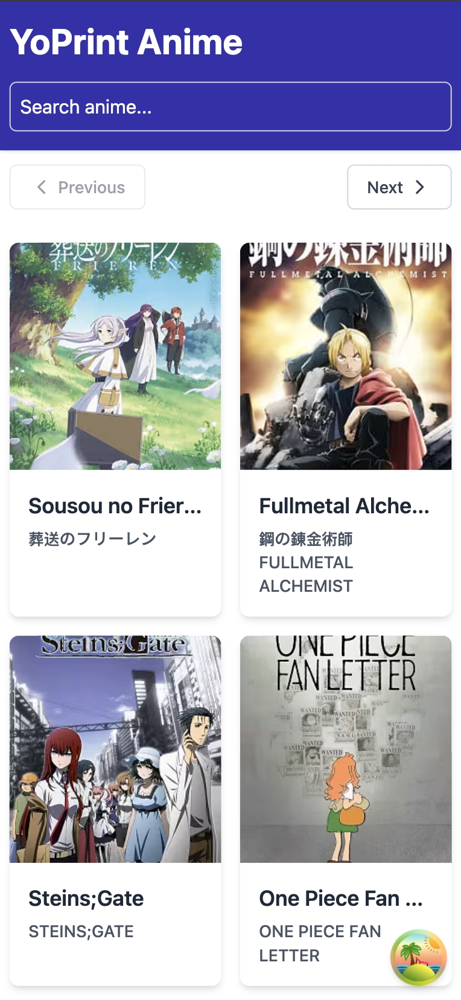
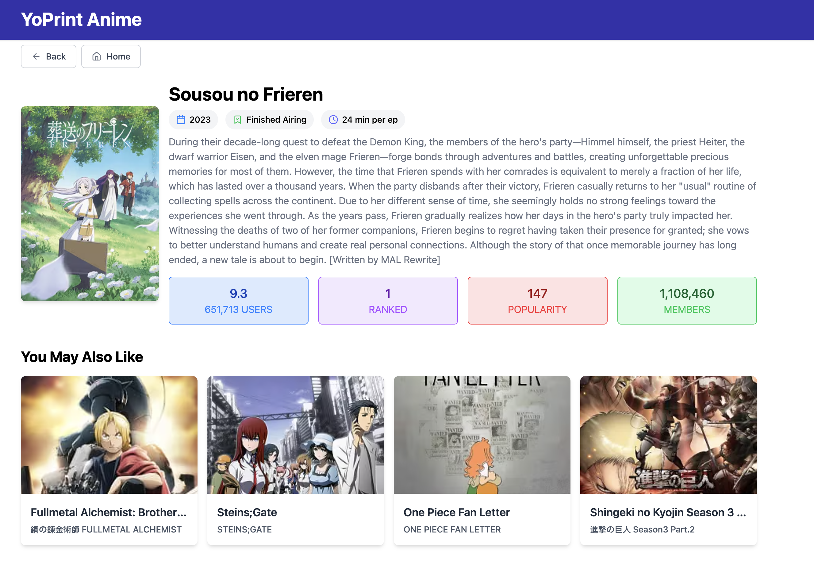

# YoPrint Anime

YoPrint Anime is a web application for browsing and exploring anime content. Built with modern web technologies and optimized for performance.

## 📋 Features

- Browse anime collections
- Search and filter functionality
- Responsive design for all devices
- Offline capabilities (PWA)
- Fast loading and navigation

## 🛠️ Tech Stack

- **React**: Frontend UI library
- **TypeScript**: Type-safe JavaScript
- **React Router**: File-based routing
- **React Query**: Data fetching and cache management
- **PWA**: Progressive Web App capabilities for offline use

## 📸 Screenshots

### Home Page

### Anime Details

